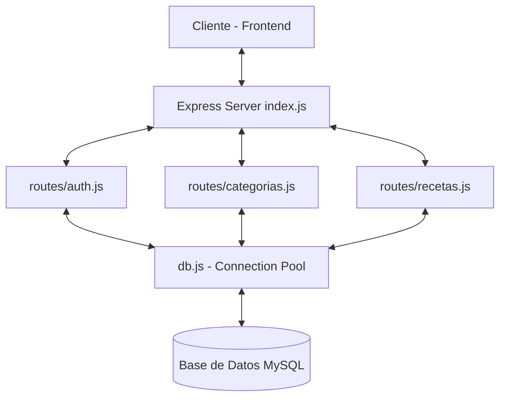

# Documentación del Backend — Recetario

Este documento detalla la arquitectura, endpoints, estructura de archivos y librerías utilizadas en la API REST del **Recetario**.

---

## 1. Arquitectura del Backend

El backend está desarrollado sobre **Node.js** utilizando **Express** como framework web y **MySQL** como motor de almacenamiento. La arquitectura sigue un diseño modular y desacoplado, estructurado en base a enrutadores y controladores de base de datos.



### Componentes de la Arquitectura:
1. **Servidor (`index.js`)**: Configura el puerto (`3001`), los middlewares globales para manejo de peticiones JSON (`express.json()`) e intercambio de recursos con el cliente React (`cors()`), y delega las rutas correspondientes.
2. **Mapeador de Base de Datos (`db.js`)**: Crea y expone un pool de conexiones mediante la biblioteca `mysql2/promise`. Esto permite un uso eficiente de los recursos al reutilizar conexiones existentes y habilitar el manejo asíncrono con promesas (`async/await`).
3. **Módulo de Rutas (`routes/`)**: Encapsula las consultas SQL parametrizadas y la lógica de negocio para cada entidad de la aplicación (Autenticación, Categorías y Recetas).

---

## 2. Librerías y Dependencias Utilizadas

Las librerías del backend se gestionan en el archivo [package.json](file:///c:/Users/sacha/OneDrive/Escritorio/Lboratorio/recetario/backend/package.json). A continuación se detallan las principales tecnologías:

| Librería / Dependencia | Versión | Descripción / Propósito |
| :--- | :--- | :--- |
| **`express`** | `^5.2.1` | Framework minimalista y flexible para crear la API y gestionar rutas y peticiones HTTP de manera eficiente. |
| **`mysql2`** | `^3.22.3` | Cliente MySQL de alto rendimiento para Node.js. Soporta consultas preparadas y el uso nativo de promesas (`Promise`). |
| **`cors`** | `^2.8.6` | Middleware utilizado para habilitar y configurar el Intercambio de Recursos de Origen Cruzado (CORS), permitiendo peticiones desde el origen del frontend (Vite). |
| **`dotenv`** | `^17.4.2` | Biblioteca que carga variables de entorno desde un archivo `.env` en `process.env`, protegiendo credenciales sensibles. |
| **`nodemon`** (Dev) | `^3.1.14` | Herramienta de desarrollo que reinicia automáticamente el servidor Node.js al detectar cambios en los archivos del proyecto. |

---

## 3. Estructura de Carpetas (Backend)

```
backend/
├── routes/                 # Controladores y rutas de la API
│   ├── auth.js             # Autenticación de usuarios (POST /auth/login)
│   ├── categorias.js       # Rutas para obtener categorías (GET /categorias)
│   └── recetas.js          # CRUD completo de recetas (GET, POST, PUT)
├── db.js                   # Configuración del Pool de conexiones MySQL
├── index.js                # Punto de entrada de la aplicación Express
├── package.json            # Configuración de Node.js y dependencias
└── .env                    # Configuración de variables de entorno (no versionado)
```

---

## 4. Endpoints de la API

La base de datos y la API REST corren localmente en la dirección `http://localhost:3001`.

| Método | Endpoint | Parámetros del Body (JSON) | Estado Éxito | Descripción |
| :--- | :--- | :--- | :--- | :--- |
| **`POST`** | `/auth/login` | `{ email, password }` | `200 OK` | Valida las credenciales del usuario directamente en la base de datos (texto plano) y devuelve un objeto de confirmación con el ID y correo del usuario. |
| **`GET`** | `/categorias` | *Ninguno* | `200 OK` | Recupera el listado completo de categorías que se encuentran activas (`activo = 1`). |
| **`GET`** | `/recetas` | *Ninguno* | `200 OK` | Obtiene el listado de recetas activas (`activo = 1`) realizando un `JOIN` con la tabla `categorias` para incluir el nombre de la categoría. Ordenado por fecha de creación descendente. |
| **`GET`** | `/recetas/:id` | *En la URL (:id)* | `200 OK` | Obtiene el detalle completo de una receta activa específica buscando por su clave primaria (`id_receta`). Si no existe o está inactiva, devuelve `404 Not Found`. |
| **`POST`** | `/recetas` | `{ nombre, descripcion, ingredientes, pasos, tiempo_preparacion, id_categoria }` | `201 Created` | Registra una nueva receta. `nombre` e `id_categoria` son obligatorios. El usuario creador se asigna de forma por defecto en el backend. |
| **`PUT`** | `/recetas/:id` | `{ nombre, descripcion, ingredientes, pasos, tiempo_preparacion, id_categoria }` | `200 OK` | Modifica todos los campos de una receta existente identificada por su ID. Devuelve `404` si la receta no existe o está dada de baja. |
| **`PUT`** | `/recetas/:id/baja` | *En la URL (:id)* | `200 OK` | Realiza la **baja lógica** de una receta, cambiando su estado `activo` a `0`. |

---

## 5. Convenciones de Desarrollo y Diseño

### 5.1. Esquema de Baja Lógica
Para mantener la integridad histórica de los datos y evitar la pérdida de información accidental, la API **nunca elimina registros físicamente** (no utiliza sentencias `DELETE`). En su lugar:
- Se implementa el campo booleano `activo` (por defecto `1`).
- Al eliminar una receta, se realiza una petición a `/recetas/:id/baja` que ejecuta un `UPDATE receta SET activo = 0 WHERE id_receta = ?`.
- Las consultas habituales (`SELECT`) siempre filtran utilizando la condición `WHERE activo = 1`.

### 5.2. Prevención de Inyección SQL (Seguridad)
Todas las consultas ejecutadas contra la base de datos MySQL utilizan marcadores de posición parametrizados (`?`). Ejemplo:
```javascript
db.query('SELECT * FROM usuarios WHERE email = ? AND activo = 1', [email]);
```
Esto asegura que el driver de la base de datos sanitice automáticamente cualquier entrada proveniente del usuario, previniendo inyecciones de código malicioso.

### 5.3. Control de Errores e Integridad
- Los bloques controladores de rutas están envueltos en estructuras `try/catch`. Ante cualquier error del servidor de base de datos, el backend responde con un código de estado `500 Internal Server Error` y el mensaje detallado del error en formato JSON para simplificar la depuración.
- Se valida la existencia y tipo de los datos básicos en el body de los requests antes de interactuar con la base de datos (por ejemplo, asegurándose de que `nombre` e `id_categoria` no sean nulos).
