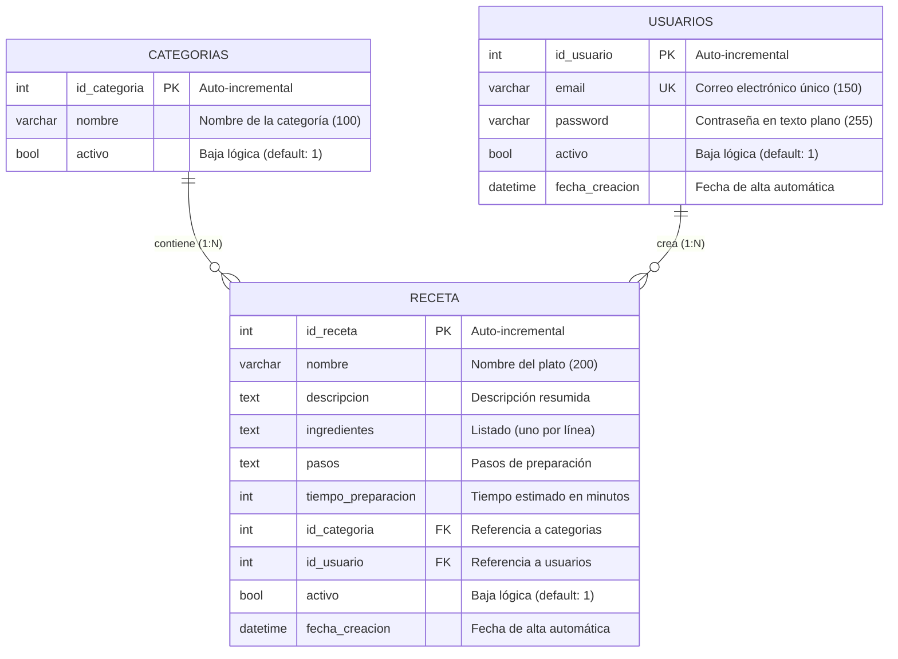

# Documentación de la Base de Datos — Recetario

Este documento describe la arquitectura, el modelo de datos, la estructura de las tablas y las relaciones de la base de datos MySQL utilizada por la aplicación **Recetario**.

---

## 1. Arquitectura de la Base de Datos

El almacenamiento de la aplicación está soportado por un motor relacional **MySQL (versión 8.0 o superior)**. La base de datos lleva por nombre `recetario` y utiliza la codificación de caracteres `utf8mb4` con el colamiento `utf8mb4_unicode_ci` para garantizar soporte completo a caracteres especiales y emojis.

La estructura cuenta con tres tablas principales:
- **`usuarios`**: Almacena las credenciales básicas y estado de los usuarios que pueden acceder al sistema.
- **`categorias`**: Permite organizar las recetas en diferentes grupos (ej. Entrada, Plato principal, Postre).
- **`receta`**: Almacena toda la información técnica y de preparación de los platos, relacionándose directamente con un creador (usuario) y una categoría.

---

## 2. Diagrama Entidad-Relación (ERD)

A continuación se muestra el esquema relacional de la base de datos:

---

## 3. Diccionario de Datos (Estructura de Tablas)

### 3.1. Tabla `categorias`
Esta tabla define las secciones bajo las cuales se pueden clasificar las recetas.

| Campo | Tipo de Datos | Nulo | Clave | Predeterminado | Descripción |
| :--- | :--- | :---: | :---: | :---: | :--- |
| **`id_categoria`** | `INT` | No | **PK** | *Auto-increment* | Identificador único numérico de la categoría. |
| **`nombre`** | `VARCHAR(100)` | No | | | Nombre legible de la categoría (ej. 'Entrada', 'Sopa'). |
| **`activo`** | `TINYINT(1)` / `BOOL` | No | | `1` | Bandera de estado para la baja lógica (`1`: Activo, `0`: Inactivo). |

### 3.2. Tabla `usuarios`
Almacena la información de autenticación necesaria para que los administradores o cocineros ingresen al sistema.

| Campo | Tipo de Datos | Nulo | Clave | Predeterminado | Descripción |
| :--- | :--- | :---: | :---: | :---: | :--- |
| **`id_usuario`** | `INT` | No | **PK** | *Auto-increment* | Identificador único numérico del usuario. |
| **`email`** | `VARCHAR(150)` | No | **UK** | | Correo electrónico único utilizado como login. |
| **`password`** | `VARCHAR(255)` | No | | | Contraseña en texto plano para validación de acceso. |
| **`activo`** | `TINYINT(1)` / `BOOL` | No | | `1` | Bandera de estado para la baja lógica (`1`: Activo, `0`: Inactivo). |
| **`fecha_creacion`** | `DATETIME` | No | | `CURRENT_TIMESTAMP` | Fecha y hora exacta en la que se registró el usuario en el sistema. |

### 3.3. Tabla `receta`
Almacena la información principal de los platos e instrucciones de preparación.

| Campo | Tipo de Datos | Nulo | Clave | Predeterminado | Descripción |
| :--- | :--- | :---: | :---: | :---: | :--- |
| **`id_receta`** | `INT` | No | **PK** | *Auto-increment* | Identificador único numérico de la receta. |
| **`nombre`** | `VARCHAR(200)` | No | | | Título o nombre del plato (ej. 'Milanesa a la napolitana'). |
| **`descripcion`** | `TEXT` | Sí | | | Breve reseña o explicación de qué es la receta. |
| **`ingredientes`** | `TEXT` | Sí | | | Listado de ingredientes necesarios (se separa por saltos de línea `\n`). |
| **`pasos`** | `TEXT` | Sí | | | Instrucciones numeradas paso a paso para la preparación. |
| **`tiempo_preparacion`**| `INT` | Sí | | | Tiempo estimado de preparación expresado en minutos. |
| **`id_categoria`** | `INT` | No | **FK** | | Relación con la tabla `categorias`. Indica bajo qué clasificación cae la receta. |
| **`id_usuario`** | `INT` | No | **FK** | | Relación con la tabla `usuarios`. Identifica al usuario creador de la receta. |
| **`activo`** | `TINYINT(1)` / `BOOL` | No | | `1` | Bandera de estado para la baja lógica (`1`: Activo, `0`: Inactivo). |
| **`fecha_creacion`** | `DATETIME` | No | | `CURRENT_TIMESTAMP` | Fecha y hora de alta automática de la receta en el sistema. |

#### Restricciones de Claves Foráneas (Foreign Keys):
- **`fk_categoria`**: Vincula `receta(id_categoria)` con `categorias(id_categoria)`. Evita clasificar recetas en categorías inexistentes.
- **`fk_usuario`**: Vincula `receta(id_usuario)` con `usuarios(id_usuario)`. Asegura la existencia del usuario responsable.

---

## 4. Inicialización y Carga de Datos

El script SQL completo que contiene tanto las sentencias de definición de datos (**DDL**: creación de la base de datos, tablas y restricciones) como las sentencias de manipulación de datos (**DML**: carga de categorías por defecto, usuario administrador inicial `Admin@gmail.com` / `1234!` y recetas sembradas de prueba) se encuentra en el archivo:

👉 **[base_de_datos.md](file:///c:/Users/sacha/OneDrive/Escritorio/Lboratorio/recetario/documentacion/base_de_datos.md)**

### Pasos para configurar la base de datos:
1. Conéctate a tu servidor local de MySQL utilizando un cliente como **MySQL Workbench**, **DBeaver** o terminal.
2. Abre una ventana de query y pega el contenido completo del script SQL que figura en [base_de_datos.md](file:///c:/Users/sacha/OneDrive/Escritorio/Lboratorio/recetario/documentacion/base_de_datos.md).
3. Ejecuta el script. Esto creará el esquema `recetario` de manera automática y poblará las tablas con todos los datos necesarios para que la aplicación frontend y backend funcione de inmediato.
