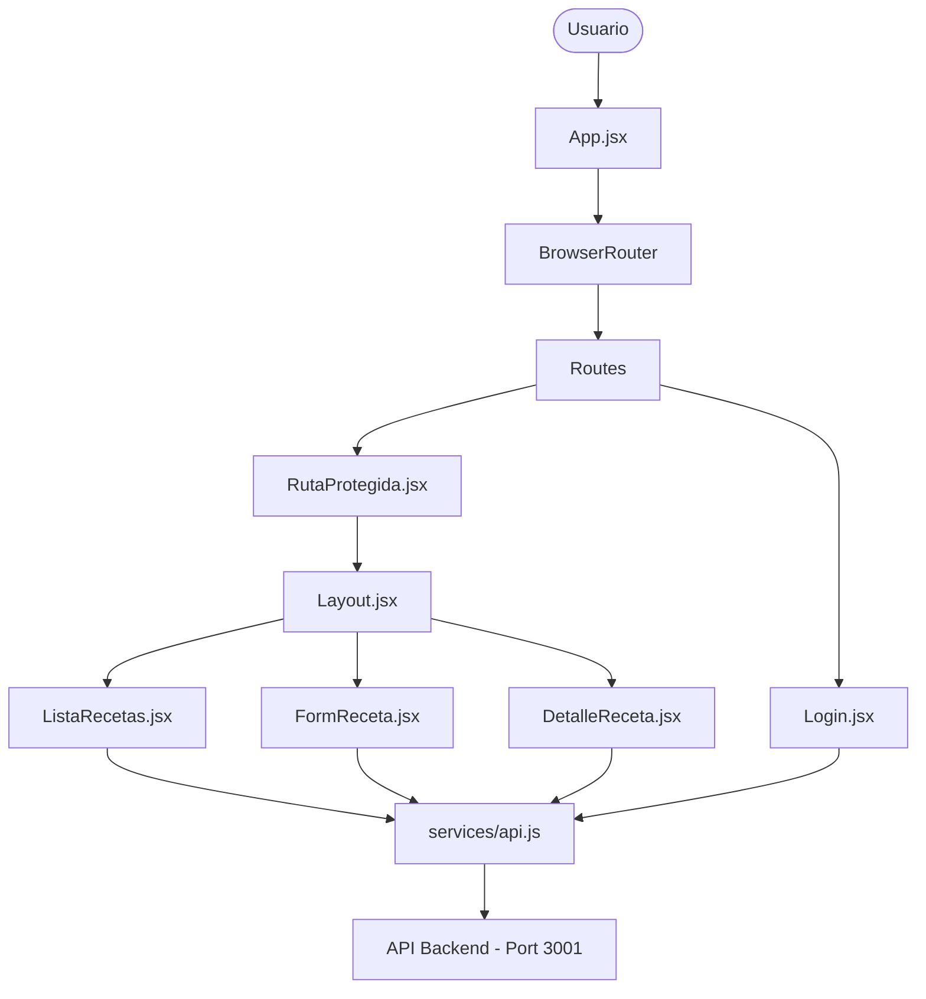

# Documentación del Frontend — Recetario

Este documento detalla la arquitectura, maquetación, estructura de archivos y librerías utilizadas en la interfaz de usuario de la aplicación **Recetario**.

---

## 1. Arquitectura del Frontend

El frontend está desarrollado como una **Single Page Application (SPA)** usando **React 19** y compilado con **Vite**.



### Componentes de Control e Infraestructura:
- **`App.jsx`**: Punto de entrada de la navegación. Configura el enrutador de React y define las rutas públicas y protegidas.
- **`RutaProtegida.jsx`**: Componente de Orden Superior (HOC) que intercepta la navegación. Comprueba si el usuario está autenticado leyendo la clave `usuarioAutenticado` en el `localStorage`. Si no existe, redirige automáticamente a `/login`.
- **`services/api.js`**: Capa de abstracción de red. Agrupa las peticiones HTTP (`fetch`) al backend para mantener los componentes limpios de lógica de red.

---

## 2. Librerías y Dependencias Utilizadas

Las librerías del frontend se gestionan en el archivo [package.json](file:///c:/Users/sacha/OneDrive/Escritorio/Lboratorio/recetario/frontend/package.json). A continuación se detallan las principales tecnologías:

| Librería / Dependencia | Versión | Descripción / Propósito |
| :--- | :--- | :--- |
| **`react`** | `^19.2.6` | Biblioteca principal de JavaScript para construir interfaces de usuario basadas en componentes. |
| **`react-dom`** | `^19.2.6` | Paquete que sirve como entrada para el renderizado de React en el DOM del navegador. |
| **`react-router-dom`** | `^7.15.1` | Manejador de rutas para aplicaciones SPA en React. Permite la navegación sin recargar la página. |
| **`bootstrap`** | `^5.3.8` | Framework CSS para diseño responsivo. Proporciona componentes visuales, grillas y utilidades de estilo rápido. |
| **`font-awesome`** (CDN) | `6.4.0` | Biblioteca externa de iconos vectoriales para elementos de la interfaz (botones, navbar, etc.). |
| **`vite`** | `^8.0.12` | Herramienta de compilación ultra rápida para desarrollo moderno de frontend (Bundler & Dev Server). |
| **`eslint`** | `^10.3.0` | Herramienta de análisis estático para identificar y corregir problemas en el código de JavaScript/React. |

---

## 3. Estructura de Carpetas (Frontend)

```
frontend/
├── public/                 # Recursos estáticos servidos directamente
│   ├── css/
│   │   └── styles.css      # Estilos CSS personalizados (SB Admin template)
│   └── favicon.svg
├── src/                    # Código fuente del frontend
│   ├── assets/             # Imágenes y recursos multimedia
│   │   ├── fondo3.jpeg     # Fondo cálido del recetario
│   │   └── Sacha2.jpeg     # Logo "La Cocina de Sacha"
│   ├── components/         # Componentes React reutilizables e infraestructura
│   │   ├── Layout.jsx      # Contenedor base de la aplicación (Navbar + Footer)
│   │   ├── ModalConfirmar.jsx # Modal genérico para confirmar bajas lógicas
│   │   └── RutaProtegida.jsx  # Guard de navegación y seguridad
│   ├── pages/              # Vistas completas de la aplicación
│   │   ├── DetalleReceta.jsx # Detalle de ingredientes y pasos de una receta
│   │   ├── FormReceta.jsx    # Formulario dinámico para Alta y Modificación
│   │   ├── ListaRecetas.jsx  # Tabla de recetas con búsqueda y filtros
│   │   └── Login.jsx         # Pantalla de acceso
│   ├── services/           # Lógica de comunicación con el exterior
│   │   └── api.js          # Métodos para consumir la API REST del backend
│   ├── App.jsx             # Enrutador principal de la app
│   ├── index.css           # Estilos CSS globales adicionales
│   └── main.jsx            # Inicializador e inyector de React en el DOM
├── index.html              # Archivo HTML inicial cargado por el navegador
└── package.json            # Configuración y dependencias del proyecto
```

---

## 4. Maquetación y Diseño Visual (Layout & Views)

La interfaz utiliza una combinación del framework **Bootstrap 5** y una estética personalizada que imita una cocina rústica, moderna y hogareña.

### 4.1. Contenedor Base (`Layout.jsx`)
Todas las páginas protegidas se renderizan dentro de este contenedor para unificar la navegación:
1. **Top Navbar**: 
   - Barra superior oscura (`bg-dark`) con el logotipo de la marca (`Sacha2.jpeg`), el nombre del sitio "La Cocina de Sacha" y enlaces rápidos con iconos de FontAwesome.
   - Incluye un botón para **Cerrar Sesión** estilizado en rojo pastel (`bg-danger-subtle`) que elimina la credencial local y redirige al Login.
2. **Main Area**: 
   - Fondo dinámico con la imagen `fondo3.jpeg` superpuesta con un gradiente semitransparente cálido (`linear-gradient(rgba(255, 247, 235, 0.70), rgba(255, 247, 235, 0.70))`) para asegurar la legibilidad del texto.
   - Ocupa todo el alto disponible (`minHeight: 'calc(100vh - 76px)'`) con diseño flexible vertical (`flexDirection: 'column'`).
3. **Footer**: 
   - Pie de página fijo al fondo con derechos de autor y créditos mínimos sobre un color oscuro (`bg-dark`).

### 4.2. Pantalla de Acceso (`Login.jsx`)
- **Estilo**: Centrado absoluto en pantalla con el fondo `fondo3.jpeg` completo.
- **Card**: Contenedor con efecto de vidrio esmerilado (Glassmorphism):
  - Fondo blanco-arena muy translúcido (`rgba(251, 244, 233, 0.90)`).
  - Desenfoque de fondo (`backdropFilter: 'blur(8px)'`).
  - Bordes redondeados y sombra pronunciada para dar profundidad.
- **Interactividad**:
  - Campos de entrada con borde secundario y texto oscuro.
  - Indicador visual "Verificando..." al enviar datos para evitar dobles clics.
  - Alerta de error dinámica si las credenciales fallan o el servidor no responde.

### 4.3. Listado de Recetas (`ListaRecetas.jsx`)
- **Filtro**: Selector de categoría desplegable limpio, sin bordes aparatosos, integrado directamente sobre la tabla.
- **Tabla**: 
  - Fondo transparente (`--bs-table-bg: transparent`) y efecto interactivo al pasar el mouse por encima (`table-hover`).
  - Columnas bien definidas: Nombre de la receta (enlace clickable), Categoría (representada con un *Badge* gris de Bootstrap), Tiempo de preparación en minutos y Acciones.
- **Acciones**: Botones flotantes compactos utilizando colores pastel suaves (`bg-primary-subtle` para editar y `bg-danger-subtle` para dar de baja lógica) para no sobrecargar visualmente la pantalla.

### 4.4. Ficha de Detalle (`DetalleReceta.jsx`)
- Presentación limpia tipo ficha técnica.
- **Cabecera**: Muestra la categoría y el tiempo de preparación con un emoji de cronómetro (`⏱`).
- **Layout en Dos Columnas (Grilla Bootstrap)**:
  - **Columna Izquierda (col-md-4)**: Listado de ingredientes en formato de lista limpia (`list-group-flush`), separada con líneas sutiles.
  - **Columna Derecha (col-md-8)**: Pasos de preparación enumerados. La aplicación limpia automáticamente los prefijos numéricos duplicados (ej. convierte `"1. Mezclar..."` a un ítem `<li />` nativo de HTML limpio).

### 4.5. Formulario de Receta (`FormReceta.jsx`)
- **Dinamismo**: El mismo componente maneja el alta (`/nueva`) y la edición (`/editar/:id`), cambiando el título de la página y el botón de acción automáticamente.
- **Validaciones Integradas en Frontend**:
  - Comprobación de campos obligatorios al enviar (`handleSubmit`). Si hay errores, se marcan en rojo (`is-invalid`) y se muestran mensajes de ayuda dinámicos.
  - **Seguridad en Entrada Numérica**: El input de tiempo tiene una expresión regular en su manejador `onChange` (`value.replace(/[^0-9]/g, '')`) que impide la escritura de caracteres inválidos (letras, signos, decimales).
